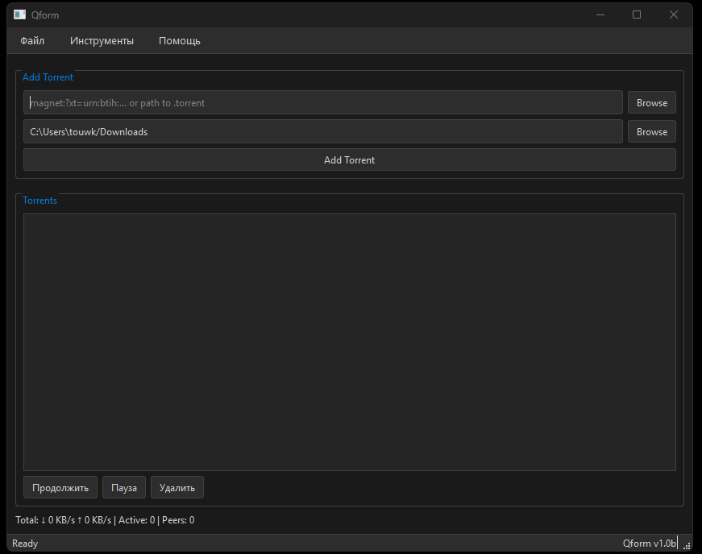
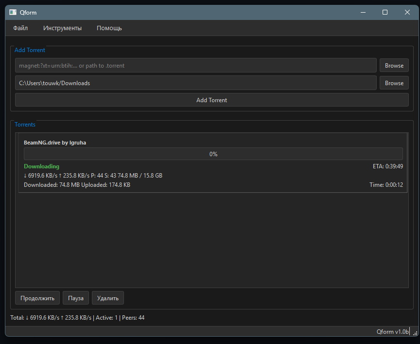

<div align="center">

# Qform


*Fast and minimal torrent client*

</div>

---

## What is this?

Qform is a torrent client built with Python, libtorrent and PyQt6. It allows downloading files via BitTorrent protocol with a simple and clean interface.

## Features

- **Download torrents** from magnet links and .torrent files
- **Multiple downloads** support
- **Resume capability** - continue downloads after restart
- **Speed control** with download/upload limits
- **Device manager** for transferring files to external drives
- **Dark theme** with two variants
- **Russian and English** interface
- **Portable** - works from any folder
- **Auto-save** - progress saved every 5 seconds

## Screenshots

<p align="center">
  
  
</p>

## How it works

Qform uses **libtorrent** session with DHT, LSD, UPnP and NAT-PMP enabled for maximum connectivity. It creates resume files in `%APPDATA%/Qform/resume/` to save download progress between sessions.

The application periodically saves torrent state every 5 seconds, ensuring no data loss on unexpected shutdown.

## Installation

### Option 1: Run from source
```bash
git clone https://github.com/tourrty-droid/qform.git
cd qform
pip install -r requirements.txt
python main.py
```
## Option 2: Download release
Download the latest `Qform.exe` from [Releases](https://github.com/tourrty-droid/qform/releases) and run it.

## Requirements
```
qform/
├── main.py # Main application
├── uninstall.py # Uninstaller
├── requirements.txt # Dependencies
├── screenshots/ # Screenshots
└── README.md
```
## Usage

1. Launch `Qform.exe` or `python main.py`
2. Paste **magnet link** or select **.torrent file**
3. Choose download directory
4. Click **Add Torrent**
## Configuration

Settings are stored in `%APPDATA%/Qform/settings/default.json`:

```json
{
  "theme": "Dark Gray",
  "language": "English",
  "download_path": "~/Downloads",
  "confirm_delete": true,
  "confirm_exit": true
}
```
## FAQ

**Q: Downloads don't start?**  
A: Check if port 6881 is open. Try adding trackers.

**Q: How to resume downloads?**  
A: Progress saves automatically. Just reopen the app.

**Q: Where are files saved?**  
A: Default is `~/Downloads`. Change in settings.

**Q: Does it work on Linux?**  
A: Currently Windows only. Linux support planned.

<div align="center">
  <sub>Built with Python, libtorrent and PyQt6</sub>
</div>
